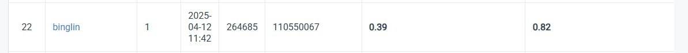

# Visual-Recognition-using-Deep-Learning-2025-Spring-HW2

| StudentID |   110550067 |
| --------- | :-----|
| **Name**  |    **簡秉霖** |


## Introduction

In this assignment, we tackle object detection and digit recognition problem using a dataset of 30,062 training images, 3,340 validation images, and 13,068 test images.  A key difficulty in this task is that the digit regions occupy only a small portion of the image, and some images are extremely low resolution—down to just 12 pixels.  Therefore, I use the FasterRCNN_ResNet50_FPN_V2 architecture with pretrained weights from Torchvision. By carefully fine-tuning hyperparameters, I achieve an impressive 0.39 mAP and 82% accuracy on the public set, demonstrating the strength of the Faster-RCNN model.

## How to install
- Python version: 3.9

- Download required packages.<br>
  `pip install -r requirements.txt`
- Check the official Pytorch website to download torch-related packages, ensuring you select the correct CUDA version (11.8 in my case). <br>
`
pip install torch==2.1.2 torchvision==0.16.2 torchaudio==2.1.2 --index-url https://download.pytorch.org/whl/cu118
`

## Dataset structure
```
dataset/
├── train/             
├── valid/             
├── test/              
├── train.json         
└── test.json          
```

## JSON file structure
- The json file should follow COCO format.
- The bounding boxes are described in the format `[x_min, y_min, w, h]`

## How to run
- Training: <br>`python train.py`
  
- Testing: <br>`python test.py`

## Performance snapshot



